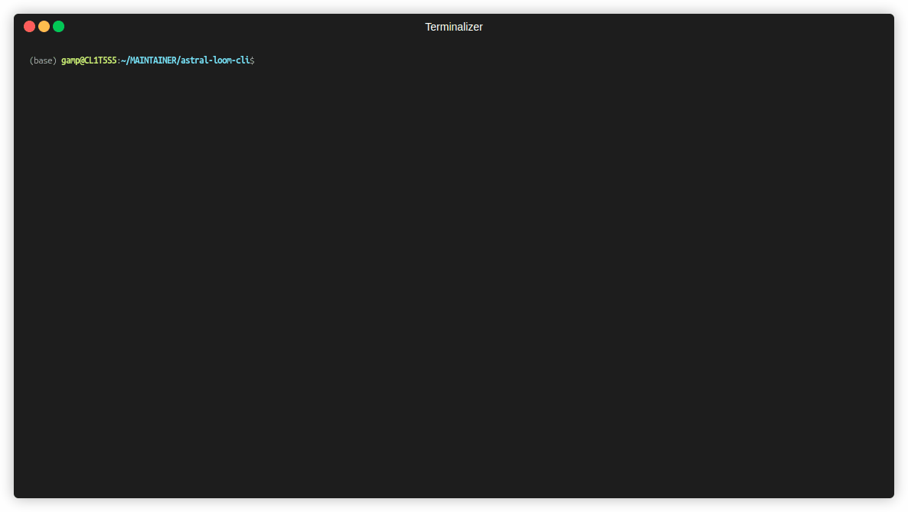
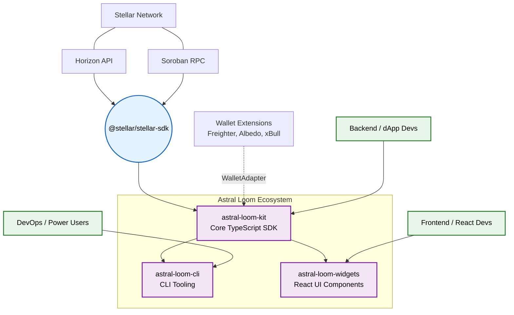

<div align="center">
  <h1>⚡ Astral Loom CLI</h1>
  <p><strong>A command-line tool for common Stellar development tasks.</strong></p>
  
  [](https://github.com/astral-loom/astral-loom-cli/actions/workflows/ci.yml)
  [](LICENSE)
  
  🌐 Website: https://astral-loom-site.vercel.app
</div>

## Demo



---

## 📖 Overview

`astral-loom-cli` is a command-line interface for Stellar dApp developers to quickly perform common tasks like creating testnet accounts and decoding XDR envelopes without leaving the terminal.

### 🏗️ Capabilities

1. **`account create`**: Create and fund testnet accounts easily.
2. **`xdr decode`**: Decode and pretty-print transaction XDR envelopes (with built-in `BigInt` serialization support).

### 🌍 Ecosystem Architecture

`astral-loom-cli` is the terminal interface for the Astral Loom ecosystem, powered by `astral-loom-kit` under the hood.



---

## 🚀 Quick Start

### 1. Installation

Clone the repo and build locally:

```bash
git clone https://github.com/astral-loom/astral-loom-cli.git
cd astral-loom-cli
npm install
npm run build
npm link
```

### 2. Usage

Use the `loom` command to access utilities:

```bash
# Create and fund a testnet account
loom account create

# Decode a base64 XDR string
loom xdr decode <xdrString>
```

---

## 💡 Examples

Check out the [examples/usage-walkthrough.md](examples/usage-walkthrough.md) for a complete terminal walkthrough showing real outputs of the CLI in action against the Stellar testnet.

---

## 🤝 Community & Maintainers

We are committed to fostering a welcoming environment. Please read our [Code of Conduct](CODE_OF_CONDUCT.md) before participating. If you discover a vulnerability, please review our [Security Policy](SECURITY.md) for reporting instructions.

Join the discussion and get support:
* **Community Link**: [Stellar Developer Discord](https://discord.gg/5aprtMSyR)

| Maintainer | Role |
|------------|------|
| Temmy2026 | Core Developer |

---

## 🛠️ Contributing

We welcome contributions! Please see our [CONTRIBUTING.md](CONTRIBUTING.md) for details on how to get started.

### 🧑‍💻 Contributors

[](https://github.com/astral-loom/astral-loom-cli/graphs/contributors)
